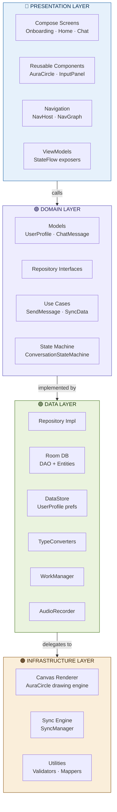
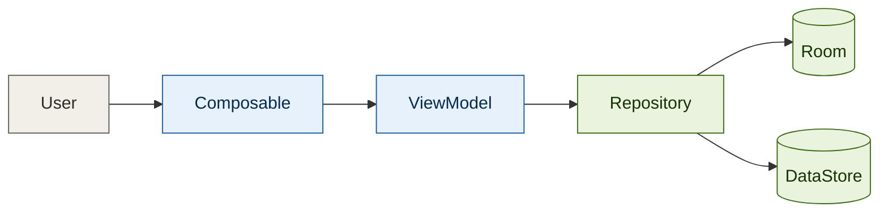
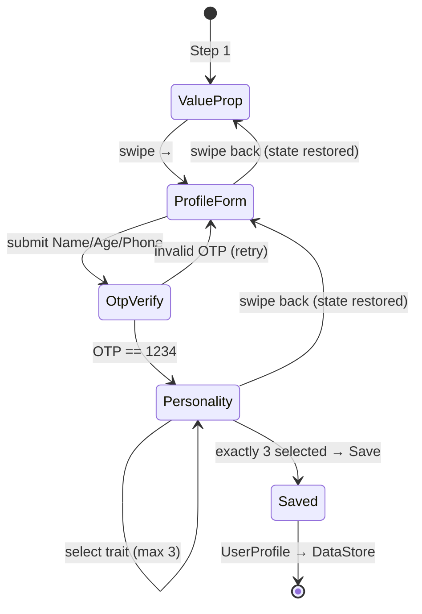
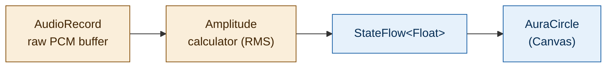
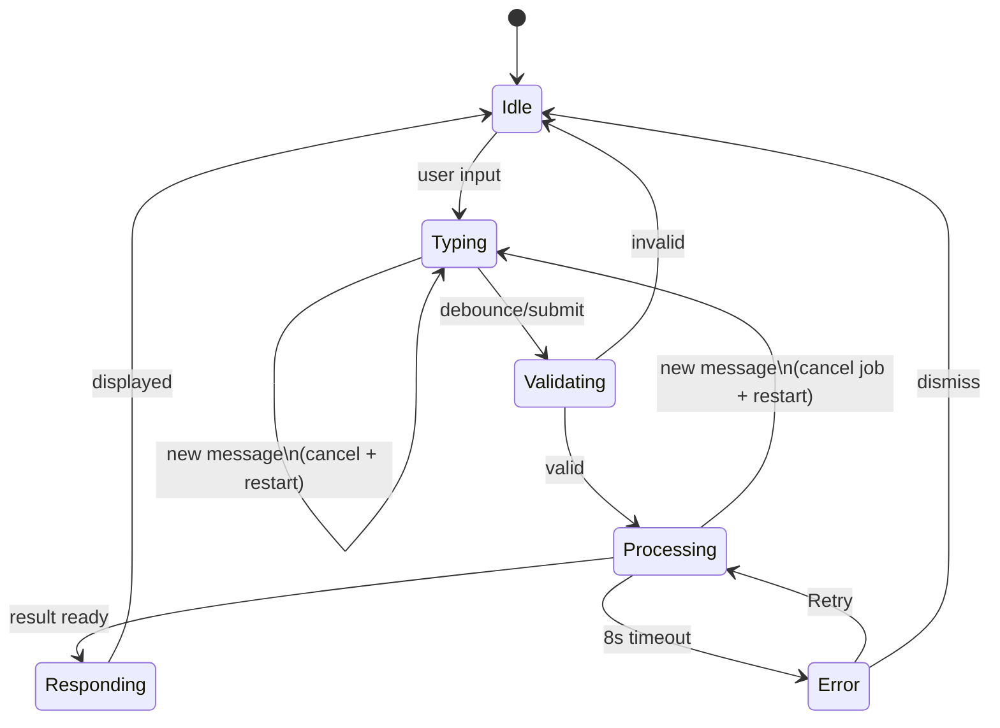
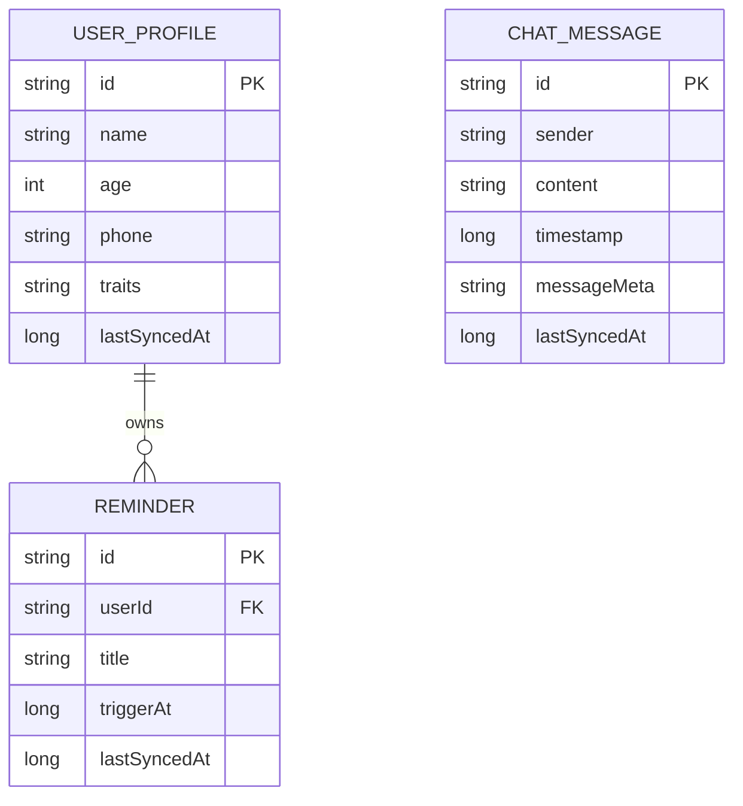
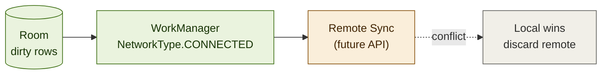
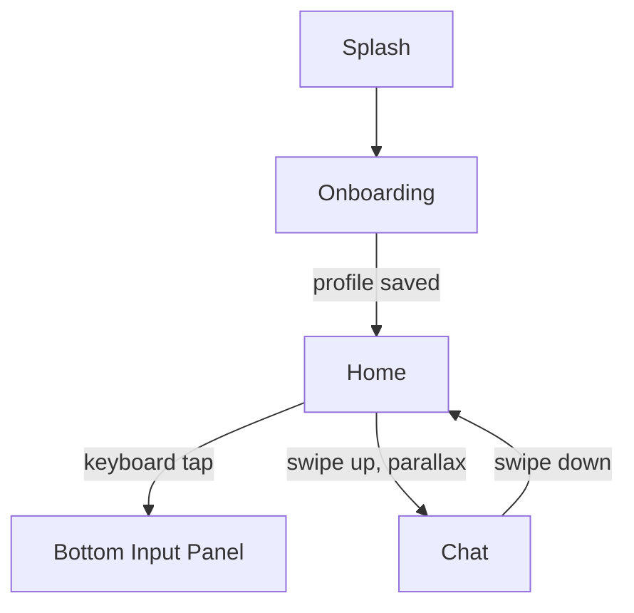

# AI Assistant — Android Architecture

MVVM + Clean Architecture · Jetpack Compose · Kotlin Coroutines · Room · DataStore · WorkManager

---

## 1. Layered Architecture



**Dependency rule:** Presentation → Domain ← Data. Domain has zero Android/framework imports. Data implements Domain's repository interfaces (dependency inversion). Infrastructure is consumed only by Data.

---

## 2. Folder Structure

```
app/
├── presentation/
│   ├── onboarding/
│   │   ├── OnboardingScreen.kt          # HorizontalPager, 3 steps
│   │   ├── ValuePropStep.kt
│   │   ├── ProfileFormStep.kt           # Name, Age, Phone, OTP
│   │   ├── PersonalityStep.kt           # exactly-3-traits selector
│   │   └── OnboardingViewModel.kt       # holds OnboardingUiState, back-nav restore
│   ├── home/
│   │   ├── HomeScreen.kt
│   │   ├── components/
│   │   │   ├── AuraCircle.kt            # reusable Canvas composable
│   │   │   ├── InputPanel.kt            # animated bottom sheet
│   │   │   └── MicAmplitudeListener.kt
│   │   └── HomeViewModel.kt
│   ├── chat/
│   │   ├── ChatScreen.kt                # LazyColumn + Paging3
│   │   ├── ChatBubble.kt
│   │   └── ChatViewModel.kt
│   ├── navigation/
│   │   ├── NavGraph.kt
│   │   └── Destinations.kt
│   └── components/                      # shared: buttons, loaders, dialogs
│
├── domain/
│   ├── model/
│   │   ├── UserProfile.kt
│   │   ├── ChatMessage.kt
│   │   ├── MessageMeta.kt
│   │   └── Reminder.kt
│   ├── repository/
│   │   ├── UserRepository.kt            # interface
│   │   ├── ChatRepository.kt            # interface
│   │   └── SyncRepository.kt            # interface
│   ├── usecase/
│   │   ├── SaveUserProfileUseCase.kt
│   │   ├── VerifyOtpUseCase.kt
│   │   ├── SendMessageUseCase.kt
│   │   ├── GetPagedMessagesUseCase.kt
│   │   └── TriggerSyncUseCase.kt
│   └── statemachine/
│       ├── ConversationState.kt         # sealed class
│       └── ConversationStateMachine.kt
│
├── data/
│   ├── repository/
│   │   ├── UserRepositoryImpl.kt
│   │   ├── ChatRepositoryImpl.kt
│   │   └── SyncRepositoryImpl.kt
│   ├── local/
│   │   ├── room/
│   │   │   ├── AppDatabase.kt
│   │   │   ├── dao/
│   │   │   │   ├── UserProfileDao.kt
│   │   │   │   ├── ChatMessageDao.kt
│   │   │   │   └── ReminderDao.kt
│   │   │   ├── entity/
│   │   │   │   ├── UserProfileEntity.kt
│   │   │   │   ├── ChatMessageEntity.kt
│   │   │   │   └── ReminderEntity.kt
│   │   │   └── converter/
│   │   │       └── MessageMetaConverter.kt
│   │   └── datastore/
│   │       └── UserProfileDataStore.kt
│   ├── audio/
│   │   └── AudioRecorderImpl.kt         # AudioRecord wrapper, emits amplitude Flow
│   └── worker/
│       └── SyncWorker.kt                # WorkManager CoroutineWorker
│
└── infrastructure/
    ├── canvas/
    │   └── AuraRenderer.kt              # breathing / listening draw logic
    ├── sync/
    │   └── SyncManager.kt               # conflict resolution, lastSyncedAt logic
    └── util/
        ├── Validators.kt                # phone/age/OTP validation
        └── Mappers.kt                   # Entity <-> Domain mapping
```

---

## 3. Core Data Flow



ViewModel never touches Room/DataStore directly — it calls a Domain use case, which calls the Repository interface. Repository impl (Data layer) decides Room vs DataStore vs both.

---

## 4. Onboarding Flow



`OnboardingViewModel` holds a single `OnboardingUiState` (all 3 steps' fields + `PagerState`). Back navigation just moves the pager — no field is cleared, so partially filled forms persist across swipes until the whole `UserProfile` is committed to DataStore at the end.

---

## 5. Audio Flow — Aura Circle



- **Idle:** `AuraCircle` runs an `infiniteRepeatable` scale/alpha animation (breathing), independent of audio.
- **Listening:** `AudioRecorderImpl` (Data/audio) reads the mic buffer on a background coroutine, computes RMS amplitude, emits it via `StateFlow<Float>`. `AuraCircle` collects this flow and maps amplitude → radius/glow in its `Canvas` `onDraw` block. Rendering math itself lives in `infrastructure/canvas/AuraRenderer.kt` so the composable stays declarative.

---

## 6. Conversation State Machine



```kotlin
sealed class ConversationState {
    object Idle : ConversationState()
    data class Typing(val draft: String) : ConversationState()
    object Validating : ConversationState()
    data class Processing(val job: Job) : ConversationState()
    data class Responding(val message: ChatMessage) : ConversationState()
    data class Error(val cause: Throwable, val lastInput: String) : ConversationState()
}
```

Implemented as a class wrapping a `MutableStateFlow<ConversationState>`. Each new message calls `currentJob?.cancel()` before launching a fresh coroutine, and `Processing` is wrapped in `withTimeout(8_000)` — a `TimeoutCancellationException` transitions straight to `Error`, which exposes a `retry()` function that re-enters `Processing` with the same payload.

---

## 7. Room Schema



`ChatMessageEntity.messageMeta` is stored as JSON text via `MessageMetaConverter : TypeConverter` (serializes `MessageMeta(intent, confidence, attachments)` with kotlinx.serialization). Every entity carries `lastSyncedAt` for the offline-first sync strategy below.

---

## 8. Offline-First Sync Flow



`SyncManager` (Infrastructure):
1. `SyncWorker` (CoroutineWorker) is constrained to `NetworkType.CONNECTED`, enqueued via `WorkManager` as periodic + on-demand.
2. Queries only rows where `lastSyncedAt < updatedAt` (dirty rows) — never a full-table push.
3. On conflict, local data always wins; remote response is merged only for fields absent locally.
4. Exposes `StateFlow<SyncStatus>` (`Idle / Syncing / Success / Failed`) that `SyncRepositoryImpl` forwards up through Domain to any ViewModel that wants a sync indicator.

---

## 9. Navigation Flow



---

## Tech Stack Summary

| Concern | Choice |
|---|---|
| UI | Jetpack Compose, Canvas API |
| Async | Kotlin Coroutines, Flow, StateFlow |
| DI | Hilt |
| Local DB | Room (+ Paging 3) |
| Prefs | DataStore (Proto/Preferences) |
| Background sync | WorkManager |
| Audio | AudioRecord (raw PCM → RMS amplitude) |
| Architecture | MVVM + Clean Architecture, 4-layer |
